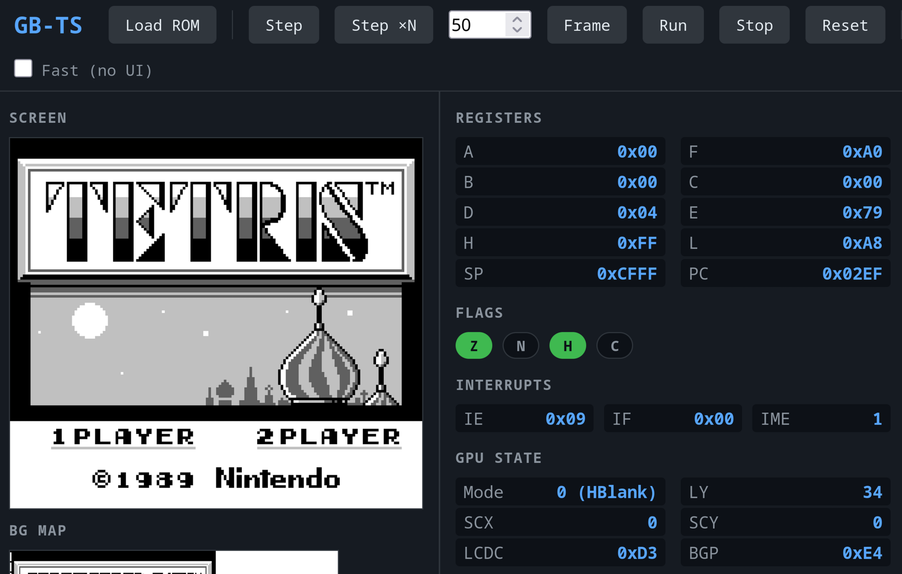

# gb-ts

Game Boy emulator written in TypeScript. Very WIP, for now it just boots the Nintendo logo.



## Installation

Clone then install all dependencies with:

```bash
npm install
```

## Building

```bash
npm run build
```

Open `dist/index.html` in a browser to run the emulator.
